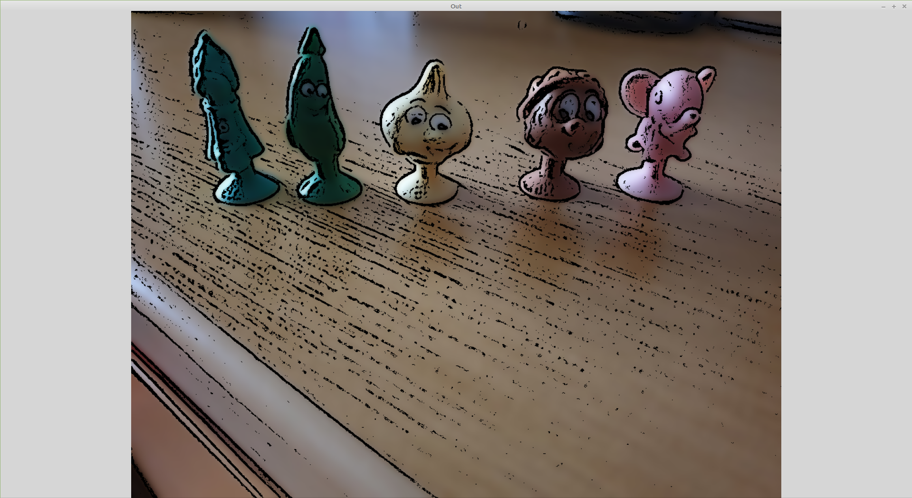

# Task 02 - Cartoonizer
Cartoonizes an image. 

[1. Running](#Run)

<a name="Run"></a>
##Running

Program takes one argument which is:
+ Path to an image you want to test
+ 1 - Loads first resource image
+ 2 - Loads second resource image

```
username@user: ~$ ./Task02 1
```

